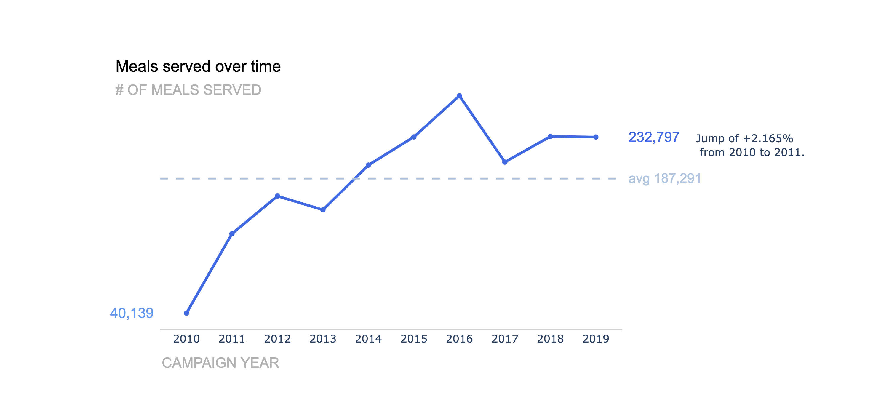

# Exercise--Upload-a-Package-to-PyPi-Udacity
Creation of a Python package to plot a well-formatted and well-labeled line graph for a time series.

## Installation
 The package can be installed using `pip install line-graph`.  
 
 The following packages are required:
 - `numpy`
 - `pandas`
 - `plotly`
