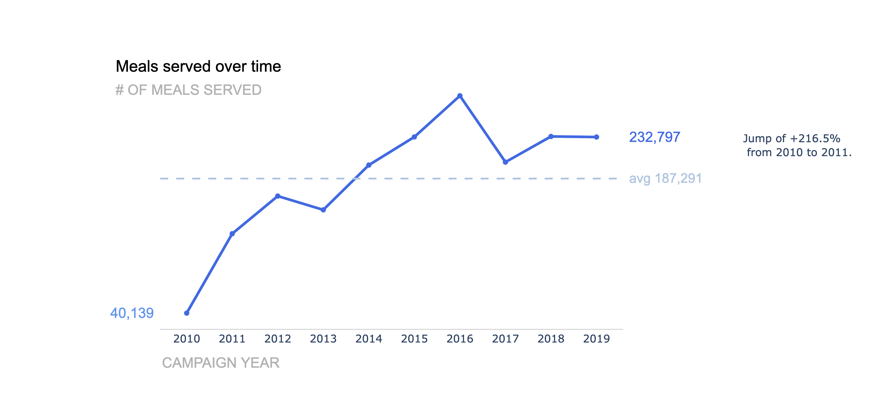

# Exercise--Upload-a-Package-to-PyPi-Udacity

## Installation
 The package can be installed using `pip install line-graph`.  
 
 The following packages are required:
 - `numpy`
 - `pandas`
 - `plotly`

## Exercise Goal

The project was completed in a series of exercises to familiarize with writing **object-oriented programming** code as part of the Data Science Nanodegree on www.udacity.com.
The Python package `line-graph` creates a **well-formatted** and **well-labeled line graph** for a **time series** and has been uploaded to PyPi www.pypi.org.

## File Description

- line_graph_package_example.ipynb contains an example of using the package to reproduce the above figure.

## Licensing, Authors, Acknowledgments

Open-source data from https://www.storytellingwithdata.com/letspractice/downloads, Exercise 2.2.
